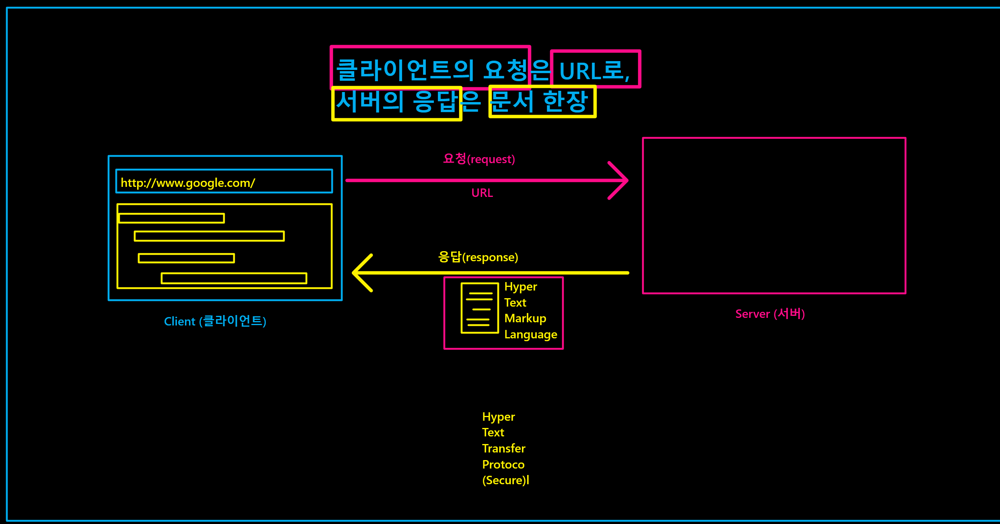

browser 에서 web을 사용한다.

밑의 circle 이 계속 반복되는 것을 의미한다.

client(ex. browser)  <---> server

요청을 보내는 주체를 클라이언트, 응답을 보내는 주체를 서버라 부른다.

web 검색 후 enter (request 요청을 하면)

검색 결과를 받아서 화면으로 본다. (response 응답을 받아서, 서버가 그 대상임)

그렇다면 browser 의 상대편에 있는 것은 무엇인가?


## 클라이언트의 요청은 URL로, 서버의 응답은 문서 한 장.




```
https://www.google.com
/
search
?
q=spdlqj
&
oq=spdlqj
&
aqs=chrome..69i57j46i10i199i465i512j0i10i512l2j46i131i199i433i465i512j0i131i433i512l2j46i10i199i465i512.1210j0j15
&
sourceid
=chrome&ie
=UTF-8

https://search.naver.com/search.naver
?where=nexearch
&
sm=top_hty
&
fbm=0
&
ie=utf8
&
query=%EC%B6%94%EC%84%9D

query=%EC%B6%94%EC%84%9D-> 부분을 받아서 다운로드함.
```


WYSIWYG

what
you
see 
is
what
you
get

`https://poiemaweb.com/html5-syntax`

### HTML(hyper txt markup language)

1. 물리적 제약이 없다.
 
2. 원하는 정보에 바로 접근이 가능하다.


### TXT

1. 실제 존재하는 곳에 가야지 확인이 가능

2.  선형적으로  탐색해야 한다.


### 통신규약 (protocol)


#### HTTP(Hyper, Text, Transfer, Protocol (Secure) )

요청, 응답의 규격, 규칙이다.

mark down 의 연장선이다.

####  web 1

도서관, 인터넷에 올라온 정보들을 조회하는 것.


####  web 2

정보를 검색하고 확인하는 것이 가능하다. 글을 작성하고 게시가 가능하다.

개인에게 기본적으로 수익이 돌아가지 않는 구조

글의 작성자에게는 주권, 소유권이 없다. 플렛폼에게 많은 것이 귀속되어 있다.


#### web 3 decentralization(탈중앙화)

개인이 소유가 가능해진다. 온전한 나의 소유에 관한 이야기이다.

사용자가 플렛폼 참여 뿐만 아니라 소유까지 하게 된다.

블록체인이 여기에서 파생된 개념이다. 모두가 가지고 있다. 독점의 구조가 아니다.
데이터, 정보가 누구 한명에게 종속되어 있지 않다.

네트워크 그 자체를 소유하고 있다. 

그렇다면 이들은 어떻게 수익을 얻는가? 그 예시가 비트코인이라고 할 수 있다.

open source vs centralization

개방? 독점, 중앙화??

글쓰는 문법


`https://www.codecademy.com/courses/learn-html/lessons/intro-to-html/exercises/intro` -> 여기서 HTML 기초 복습하기

## HTML (HyperText Markup Language)

"" 를 사용하는 것이 기본 규칙이다. 실제로 HTML 파일에서 자동으로 "" 이 입력된다.

raw(가로) text 이다. 시작과 끝을 tag를 사용해서 정해준다. 

<></> : 명령어의 시작과 끝을 나타내준다.

### `<h1></h1>`

markdown 에서의 `#` 과 같은 역할을 한다. 강조의 역할 h1~h6 까지 가능하다.


### `<body> </body>`

내용을 작성해줄 때 사용한다. 내용(content)을 채워 주기 위해서 사용한다. 본문? 큰 구성을 만들기 위해 사용 

Headings : 마크다운에서 `#` 과 같은 부분


### `<p> </p> `

문단을 나타내준다. 문단을 나눠줄 때 사용한다. 글의 내용을 적어줄 때 사용한다. `<body>` 안에서도 사용할 수 있다.

부모와 자식 관계가 존재한다. 파이썬 마지막 시간에 배웠던 class 에서의 관계와 비슷하다고 할 수 있다. 

parent, child 의 관계에서 parent의 속성이 child 에게 상속되기 때문에 수직관계(hierarchy 계급, 위계 질서)를 파악하는 것이 매우 중요하다고 할 수 있다. 

이러한 parent child 관계를 nest(묶인? 포함된?) 라고 표현한다.

다른 코드들 처럼 space 두 번(or one tab)을 사용, 들여쓰기를 하면 nest 시킬 수 가 있다.

```
An opening tag : (<p>) The content(내용) (“Hello World!” text) A closing tag : (</p>)
```

### link 연결하기

`<a href> 링크가 나타날 때 표현할 글 </a>` 
`<a href = 'https://en.wikipedia.org/wiki/Brown_bear'>Learn More</a>`

### `<Divs> </Divs> `

division 을 의미한다. 여기에 id = '' 을 사용해 속성을 부여해줄 수 있다. -> 하지만 잘 사용하지 않는다. id의 우선순위가 너무나도 높기 때문에 

블록 단위의 큰 단위를 같은 속성을 가진 것 끼리 다른 nest 를 형성하여 구별해주는 것이라고 생각해도 될 것 같다. span 보다 범위가 크다.

### `<span> </span>`

`인라인 요소`를 그룹으로 묶을 때 사용해준다. 블록 요소는 묶을 수 없다.

블럭과 인라인의 차이는 1차원과 2차원의 차이라고 보면 된다.

### `<br>`

enter 키를 사용하는 것과 같은 효과를 얻을 수 있다.


### list 관련

- `<ul></ul>` : 순서가 없는 list 

- `<ol></ol>` : 순서가 있는 리스트

두 개의 list 모두 안의 내용을 채울 때에는 `<il(inlist)></il>` 를 사용한다.


### Media file 

#### image

```

``` 

이미지 파일은 `<image/>` 로만 구성

src 속성은 이미지 파일의 위치, 링크로 이미지 파일을 불러오는 것이다.

alt 대체 텍스트로서 이미지에 대한 설명을 해주는 칸, 속성이라고 할 수 있다.

이를 활용해 이미지 파일이 손상되거나 업로드가 안될 시 이를 설명해줄 수 있는 텍스트로 표현해주는 것이 좋다.


#### video


```
<video src="myVideo.mp4" width="320" height="240" controls>
  Video not supported
</video>
```

`<video src='' width='' height='' controls></video>`

사진 파일과 동일한 형식으로 구성되어 있다. 다른 점이라면 alt 속성을 따로 부여하지 않는 다는 점이다. 

대신 controls 동영상에서 필요한 재생, 멈춤 키를 따로 설정해줘야 한다.

다른 형식은 사진 파일과 동일함.

하지만 높이, 넓이를 지정해 줄 수 있다.

alt 속성을 따로 설정하지 않고 문구를 저장해 비디오가 재생되지 않거나 업로드가 되지 않을 시 alt 처럼 도출시킬 수 있다.


### table 

<tr></tr> : table row 를 의미한다.

<td></td> : table data 를 의미한다.

<th></th> : table heading element / except with a relevant title. / scope 설정 -> table 의 특정값을 표현하기 위함. -> 범례?/ 종류/ 분류 등에 해당함.
row - this value makes it clear that the heading is for a row.
col - this value makes it clear that the heading is for a column.

<tbody></tbody>: Long tables can be sectioned off using the table body elemen table 의 구역을 나누어준다.

<thead></thead> : 첫 행을 표시해서 표에 무슨 value 들이 들어갔는지 파악해준다. th 와는 다름.

<tfoot> </tfoot>: tbody 밑에 작성해준다. tbody의 끝을 의미한다.


`<table border =''>` : it equal to an integer . 표(Table)와 테두리 그리고 셀(td)의 테두리 사이의 간격을 어떻게 처리할 지 정합니다.

css 에서는 이렇게 사용한다고 합니다.

```
table, td {
  border: 1px solid black;
}
```


#### colspan

`colspan=""` : `<td 여기에 설정해준다. ></td>`

하나의 셀 또는 행을 여러 열로 나누고 둘 이상의 열로 합병하기 위해서 사용합니다. 즉, 테이블의 셀을 가로로 합병.

#### rowspan

`rowspan=""` : `<td 여기에 설정해준다. ></td>`


#### css

``` 
<style>
    table, th, td {
  border: 18px solid black;
  font-family: Arial, sans-serif;
  text-align: center;
```

table 안에 이런 식으로 설정을 해준다.

